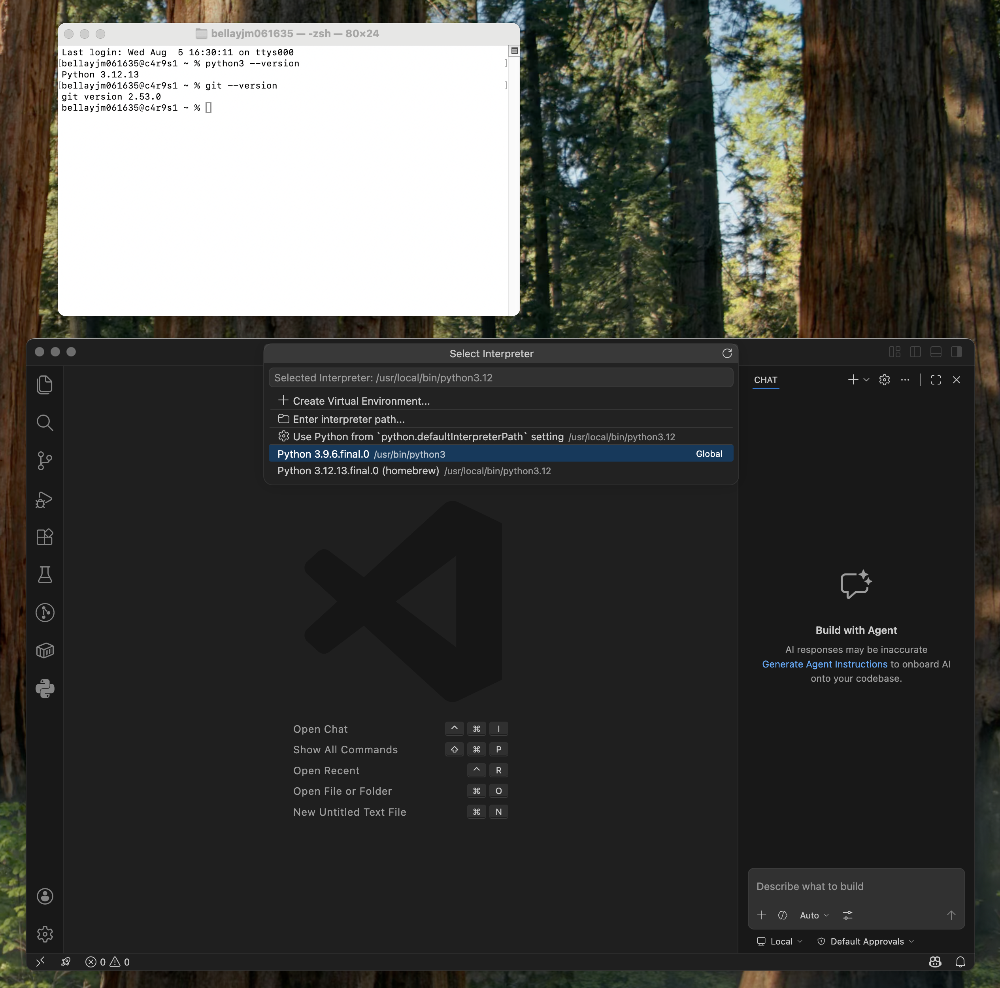
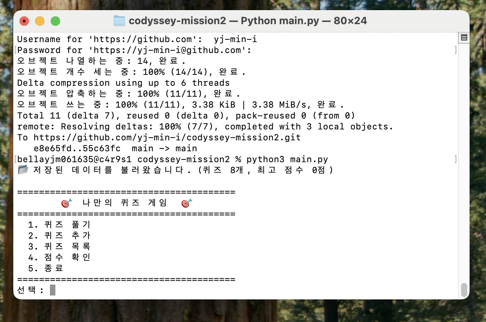
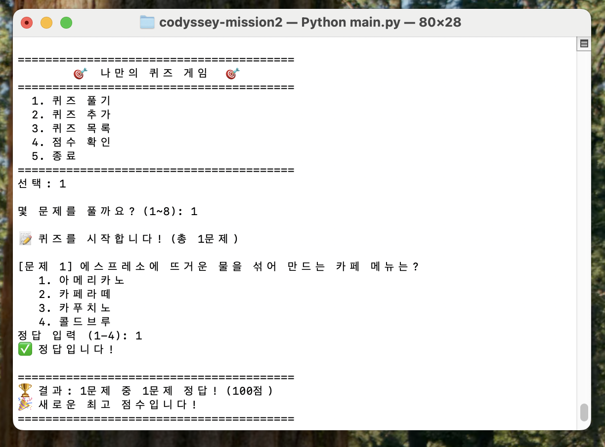
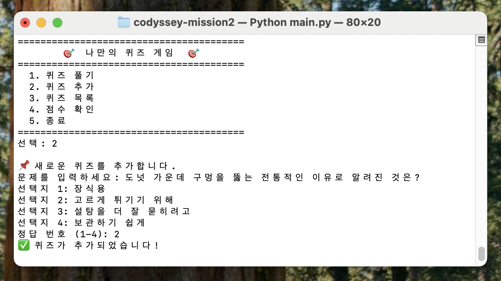
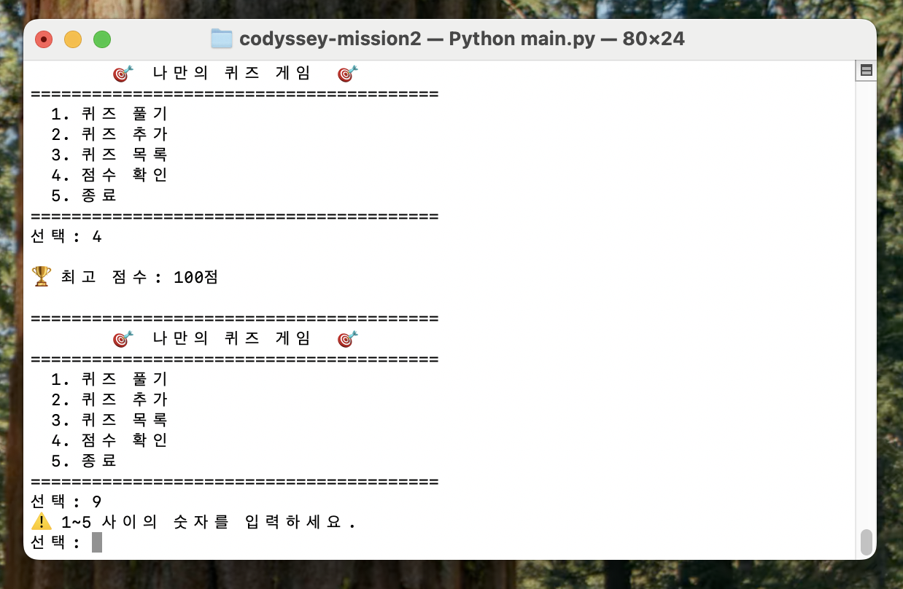
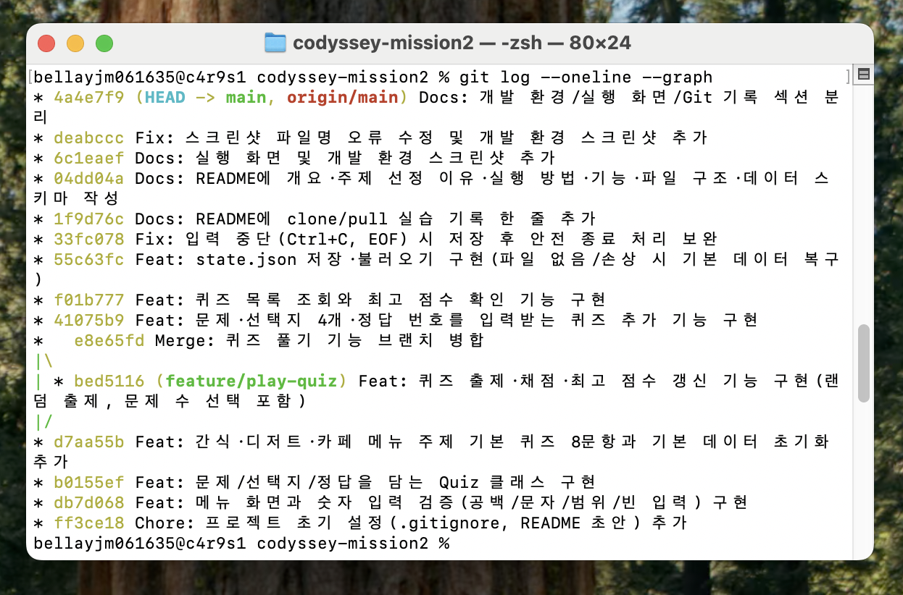

# 나만의 퀴즈 게임 (codyssey-mission2)

## 1. 프로젝트 개요
Python 기본 문법과 클래스, 파일 입출력(JSON), Git 기초 흐름을 익히기 위해 만든
터미널 기반 4지선다 퀴즈 게임입니다.
메뉴에서 번호를 선택해 퀴즈를 풀고, 새 퀴즈를 등록하고, 최고 점수를 확인할 수 있으며,
프로그램을 종료한 뒤 다시 실행해도 추가한 퀴즈와 최고 점수가 그대로 유지됩니다.
(데이터 영속성)

## 2. 퀴즈 주제와 선정 이유
- **주제: 간식·디저트·카페 메뉴 상식** (초콜릿, 과자, 아이스크림, 커피·음료, 디저트)
- 선정 이유:
  1. 평소 디저트에 대한 관심이 많아 자연스럽게 지식이 쌓인 분야였고, 좋아하는
     주제인 만큼 문제 하나하나의 정확성까지 스스로 검증하며 완성도를 높일 수
     있었습니다.
  2. 누구나 한 번쯤 먹어본 소재라 처음 보는 사람도 바로 풀 수 있어,
     터미널 프로그램의 동작을 보여주기에 적합했습니다.
  3. 정답이 시간이 지나도 바뀌지 않는 사실 위주로 골라, 나중에 문항을 늘려도
     데이터 구조를 그대로 재사용할 수 있게 했습니다.

## 3. 실행 방법
```bash
git clone https://github.com/yj-min-i/codyssey-mission2.git
cd codyssey-mission2
python3 main.py
```
- 요구 환경: Python 3.10 이상 (외부 라이브러리 없이 표준 라이브러리만 사용)

## 4. 기능 목록
| 메뉴 | 기능 | 설명 |
|---|---|---|
| 1 | 퀴즈 풀기 | 풀 문제 수를 고르고 랜덤 순서로 출제·채점하며 최고 점수를 갱신 |
| 2 | 퀴즈 추가 | 문제·선택지 4개·정답 번호를 입력받아 등록하고 즉시 파일에 저장 |
| 3 | 퀴즈 목록 | 등록된 전체 퀴즈 목록 출력 |
| 4 | 점수 확인 | 저장된 최고 점수 확인 |
| 5 | 종료 | 데이터를 저장한 뒤 종료 |

### 예외 처리
- 숫자 입력: 앞뒤 공백 제거, 숫자 변환 실패, 허용 범위 밖, 빈 입력 → 안내 후 재입력
- 실행 중 `Ctrl+C`(KeyboardInterrupt) / 입력 종료(EOFError) → 안내 후 저장하고 안전 종료
- 데이터 파일이 없거나 손상된 경우 → 안내 후 기본 퀴즈 데이터로 복구

## 5. 파일 구조
```
codyssey-mission2/
├── main.py            # 프로그램 시작점, 예외 처리 및 실행 흐름
├── quiz.py            # Quiz 클래스 (문제 1개 표현, 출력/채점/JSON 변환)
├── quiz_game.py       # QuizGame 클래스 (메뉴, 입력 검증, 각 기능, 저장/불러오기)
├── state.json         # 퀴즈 목록과 최고 점수 저장 파일
├── .gitignore
├── README.md
└── docs/screenshots/  # 실행 화면 스크린샷
```

## 6. 데이터 파일 설명 (state.json)
- 경로: 프로젝트 루트 `state.json`
- 인코딩: UTF-8 (`ensure_ascii=False` 로 한글 그대로 저장)
- 역할: 퀴즈 목록과 최고 점수를 보관해 프로그램 재실행 후에도 상태를 유지

### 스키마
```json
{
  "quizzes": [
    {
      "question": "문제 내용",
      "choices": ["선택지1", "선택지2", "선택지3", "선택지4"],
      "answer": 1
    }
  ],
  "best_score": 80
}
```

| 필드 | 타입 | 설명 |
|---|---|---|
| `quizzes` | list | 퀴즈 객체 배열 |
| `quizzes[].question` | str | 문제 내용 |
| `quizzes[].choices` | list[str] | 선택지 4개 |
| `quizzes[].answer` | int | 정답 번호 (1~4) |
| `best_score` | int | 100점 만점 기준 최고 점수 |

## 7. 개발 환경


## 8. 실행 화면





## 9. Git 활용 기록
- `init`, `add`, `commit`, `push`, `pull`, `checkout`, `clone` 사용
- `feature/play-quiz` 브랜치 생성 후 main으로 병합(`merge --no-ff`)
- 기능 단위로 10개 이상의 커밋 작성

